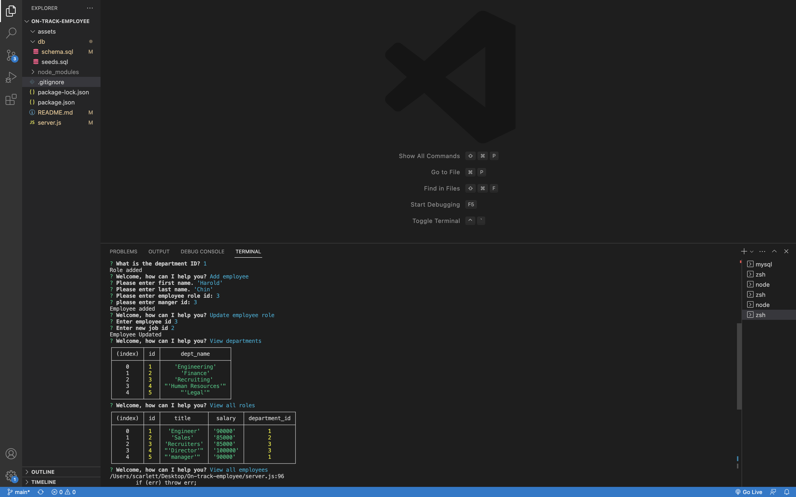

# On-track-employee

# Description
The motivation behind this project was to allow a company to easily access and track employees within the command line without needing to navigate through several different locations. Through the command line employees could easily see employee roles, departments, salaries, and managers. Roles and departments can also be added or updated through the command line. 

# Installation
In order to install this feature you would do the folllwoing:

1. clone the repository from GitHub
2. download Node.js, Inquierer, console.table, and mysql2.
3. Run npm node.js
4. Use MySql to view database.

## Usage
Once the steps above have been fixed user could run 'node server.js' and will be prompted with the menu list. User can navigate through list to view departments, add employees, or update a salary.

# License
N/A